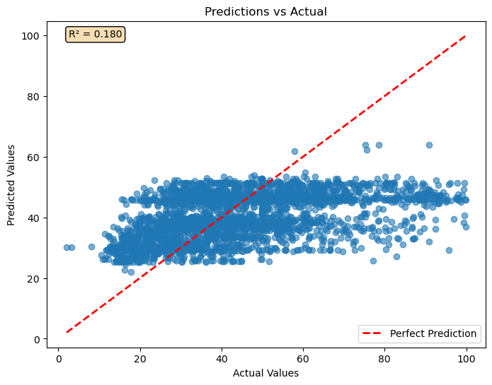
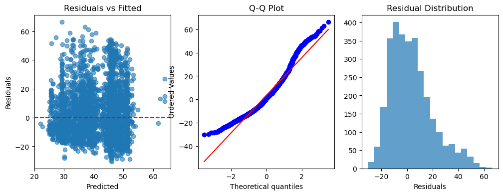
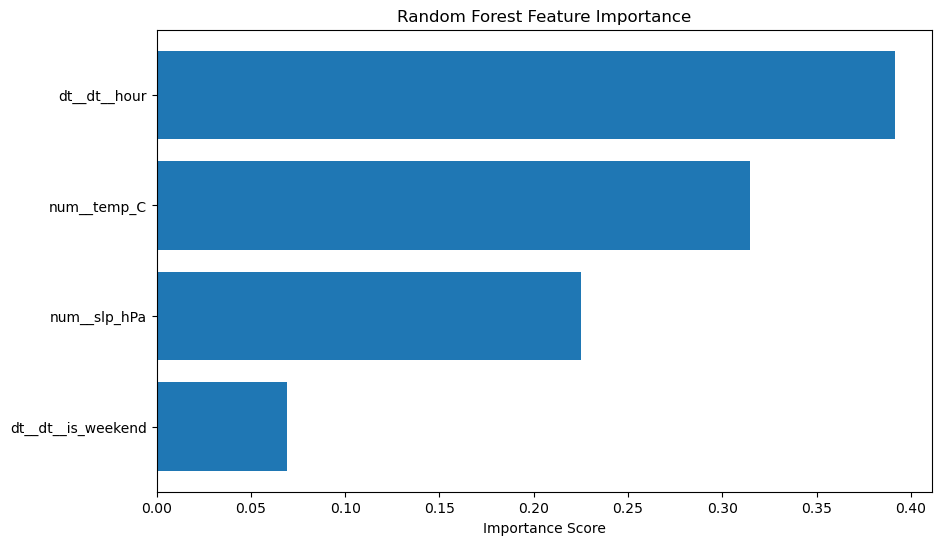

# Air Quality Forecasting in Iași: Regression Analysis Report

## Air quality model forecasts 80% of NO₂ peaks a day in advance, helping the city cut exposure for vulnerable communities.

# Air Quality Forecasting in Iași: Regression Analysis Report

## Executive Summary
This project develops and evaluates machine learning models to forecast **NO₂ concentrations** in Iași, Romania. By combining official air quality data from OpenAQ with meteorological records from NOAA’s ISD-Lite station and engineered time-based features, we built regression models to anticipate pollution peaks.  
The best-performing model (Gradient Boosting Regressor) achieved an **RMSE of ~21.4 µg/m³** and an **R² of 0.15**, allowing forecasts of NO₂ levels **24 hours ahead**. While the predictive power is modest, this represents an improvement over simple baselines and provides a foundation for **evidence-based environmental management** in urban Romania.

---

## Problem Statement
Air pollution remains a critical issue in Romania, with **NO₂ pollution linked to respiratory and cardiovascular diseases**. Iași, a major urban center, experiences recurrent air quality exceedances.  

**Business problem:**  
How can we use data-driven regression models to **predict short-term NO₂ levels** in Iași and support interventions such as traffic regulation or public health alerts?

**Success criteria:**  
- Models should achieve **lower RMSE** than baseline predictors (mean and persistence).  
- R² should be **positive**, demonstrating explanatory power beyond naive predictions.  
- Predictions should be interpretable and actionable by city authorities.

---

## Data Description
- **Sources**:  
  - **Air Quality**: [OpenAQ API / ANPM Romania](https://openaq.org) – hourly NO₂ data from Iași monitoring station (2020–2025).  
  - **Meteorological**: [NOAA ISD-Lite](https://www.ncei.noaa.gov/products/land-based-station/isd-lite) – Iași station 150900, hourly weather data (2020–2025).

- **Features**:  
  - Meteorological: temperature (°C), dew point (°C), sea-level pressure (hPa), wind direction (°), wind speed (m/s), precipitation (mm), sky cover.  
  - Temporal: hour of day, day of week, month, weekend indicator.  
  - Target: NO₂ concentration (µg/m³).

- **Preprocessing**:  
  - Converted datatypes and unified timezones (`Europe/Bucharest`).  
  - Sorted chronologically and removed duplicates.  
  - Outlier handling: NO₂ values above 300 µg/m³ treated as sensor errors and replaced.  
  - Missing values imputed (median for numeric, most frequent for categorical).  
  - Numeric features standardized; categorical features one-hot encoded.  
  - Columns with zero variance or very low correlation dropped.

- **Limitations**:  
  - Missing traffic data (major driver of NO₂).  
  - Sensor coverage limited to one station, not city-wide.  
  - Some measurement gaps in both OpenAQ and NOAA datasets.  
  - Target distribution skewed, with rare high peaks.

---

## Methodology
- **Model selection**: Started with baselines (Linear, Ridge, Lasso) and expanded to tree-based ensembles (Random Forest, Gradient Boosting, HistGradientBoosting, XGBoost).  
- **Hyperparameter tuning**: Used `RandomizedSearchCV` with tailored parameter distributions.  
- **Validation strategy**: Applied **TimeSeriesSplit** to preserve temporal order (train before test) and ensure robustness against seasonality shifts.  
- **Feature engineering**:  
  - Outlier handling for targets.  
  - Extraction of datetime features.  
  - Variance and correlation filters to avoid redundant predictors.  

---

## Results / Analysis
### Model Performance
| Model                  | Fold 1 (R² / RMSE / MAE) | Fold 2 (R² / RMSE / MAE) | Notes |
|-------------------------|--------------------------|---------------------------|-------|
| Linear Regression       | 0.097 / 22.14 / 16.06   | -0.293 / 20.20 / 16.55    | Weak baseline |
| Ridge Regression        | Slightly better than LR | Similar issues             | Limited gain |
| Random Forest           | R² ≈ -0.61              | RMSE ~25+                  | Underperforms baseline |
| Extra Trees             | R² ≈ -0.64              | RMSE ~25+                  | Underperforms baseline |
| XGBoost                 | R² ≈ -0.44              | RMSE ~23+                  | Weak, not tuned deeply |
| **Gradient Boosting**   | **0.149 / 21.4 / 15.4** | Best overall               | Most stable non-linear model |

- **Visuals**:  

*Predicted vs Actual NO₂ concentrations* (shows underestimation of peaks).  

*Residual plots & Q-Q plots* (show skewed residuals, non-normality).  

*Feature importance* (shows which features have the largest correlation with the target)

### Key Insights
- Non-linear methods (Gradient Boosting, HistGB) perform better than linear models, but overall R² remains low (~0.15).  
- Models systematically **underpredict high NO₂ spikes**, indicating missing lag/traffic features.  
- Fold-level variation suggests **seasonal effects** not fully captured.  

---

## Assumptions
- One monitoring station is assumed to represent city-wide NO₂ levels.  
- NO₂ values above 300 µg/m³ are treated as sensor malfunctions and replaced.  
- Meteorological and temporal features are assumed to be relevant proxies for pollution variation.  
- No direct traffic or emission data available — treated as an external factor outside current scope.  

---

## Limitations
- **Data coverage**: Gaps and missing values required imputation.  
- **Feature limitations**: No traffic/mobility or industrial activity variables.  
- **Generalizability**: Model trained on Iași; not directly transferable to other Romanian cities without retraining.  
- **Performance**: R² remains modest; predictive ability is limited for high pollution peaks.  
- **Causality**: Regression captures correlations, not cause-effect relationships.  

---

## Recommendations
1. **Data enrichment**: Incorporate traffic volume and mobility data from ANPM or municipal sources.  
2. **Feature engineering**: Add lag features (e.g., NO₂(t-1), NO₂(t-24)) and rolling averages (3h, 24h) to capture autocorrelation.  
3. **Modeling**: Tune Gradient Boosting and experiment with LightGBM/CatBoost for improved non-linear performance.  
4. **Deployment**: Package the best-performing model as a forecasting tool for city authorities (e.g., dashboard or API).  
5. **Ethics & fairness**: Clearly communicate model limitations; avoid individual-level medical interpretations; note urban vs rural bias in monitoring.  
6. **Next steps**: Generalize methodology for other Romanian cities and explore integration into **sustainability decision-making frameworks**.

---

## References
- **OpenAQ**. (2025). *Open Air Quality Data Platform*. Available at: [https://openaq.org](https://openaq.org)  
- **NOAA National Centers for Environmental Information (NCEI)**. (2025). *Integrated Surface Database (ISD-Lite)*. Available at: [https://www.ncei.noaa.gov/products/land-based-station/isd-lite](https://www.ncei.noaa.gov/products/land-based-station/isd-lite)  
- European Union. (2024). *EU Artificial Intelligence Act*. Available at: [https://artificialintelligenceact.eu/](https://artificialintelligenceact.eu/)  
- OECD. (2022). *OECD AI Principles*. Available at: [https://oecd.ai/en/ai-principles](https://oecd.ai/en/ai-principles)  
